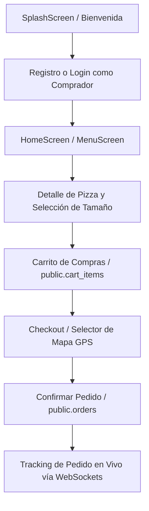
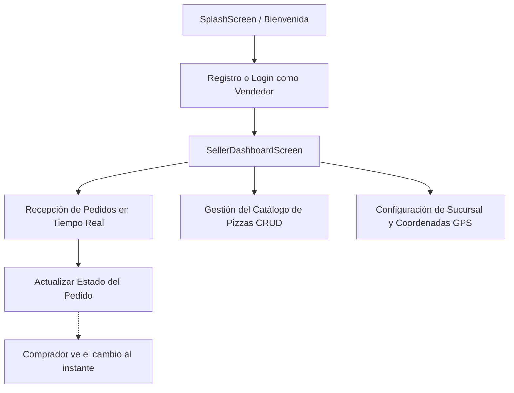

# 🍕 PizzApp - Aplicación Móvil de Pizzería en Flutter & Supabase

**PizzApp** es una plataforma móvil multiplataforma desarrollada en **Flutter** con backend en la nube en **Supabase** (PostgreSQL, Auth, Storage y Realtime WebSockets). La aplicación implementa una arquitectura limpia y reactiva con **Riverpod 3**, permitiendo dos roles de usuario independientes (**Comprador** y **Vendedor / Pizzería**) con sincronización instantánea en tiempo real.

---

## 📲 Descargar la Aplicación (APK)

Puedes descargar e instalar la versión de producción directamente en tu dispositivo Android a través del siguiente enlace:

👉 **[Descargar PizzApp APK](https://zurl.mmabitec.uk/tnqNOO)**

---

## 🌟 Funcionalidades de la Aplicación

### 🛒 1. Módulo del Comprador (Cliente)
* **Autenticación Rápida**: Registro e inicio de sesión con auto-confirmación de cuenta instantánea (sin esperas de correo) y persistencia segura de token de sesión.
* **Exploración del Menú**:
  - `HomeScreen`: Banners promocionales, buscador en vivo y pizzas populares destacadas.
  - `MenuScreen`: Catálogo completo filtrable por categorías (*Clásicas*, *Especiales*, *Gourmet*, *Vegetarianas*).
* **Detalle y Personalización**: Ficha informativa del local, selector dinámico de tamaño (*Personal*, *Mediana*, *Familiar*) con recálculo de precio y adición al carrito.
* **Carrito Persistente en Base de Datos**: Guardado en vivo en la tabla `public.cart_items` de Supabase. Tus pizzas seleccionadas se conservan al cerrar o reabrir la app.
* **Acceso y Contador Badge**: Botón de carrito en la barra superior con contador en tiempo real y FloatingActionButton interactivo.
* **Selector de Dirección en Mapa Interactivo**: Selección de coordenadas exactas mediante **OpenStreetMap** tocando el mapa o usando el sensor GPS del dispositivo.
* **Finalización de Compra (Checkout)**: Métodos de pago (Efectivo contra entrega, Tarjeta de Crédito/Débito, SPEI) e instrucciones especiales para el repartidor.
* **Tracking de Pedidos en Tiempo Real**: Visualización del estado del pedido con Stepper visual de 4 fases (*Pendiente* ➔ *En Preparación* ➔ *En Camino* ➔ *Entregado*), actualizado vía WebSockets sin recargar.

### 👨‍🍳 2. Módulo del Vendedor (Pizzería)
* **Registro de Negocio**: Creación automática de la cuenta de vendedor y de la pizzería vinculada en una sola acción.
* **Panel de Control (Dashboard)**:
  - **Pedidos en Vivo**: Lista de órdenes entrantes con alerta y selector para cambiar el estado (*En Cocina*, *En Camino*, *Entregado*).
  - **Catálogo de Pizzas**: Alta, edición y eliminación de pizzas con precio, descripción, categoría y foto por URL.
  - **Ubicación y Sucursal**: Configuración de nombre, dirección física, teléfono y captura GPS de la pizzería.
  - **Perfil**: Información de la cuenta y cierre de sesión.

---

## 🔄 Flujos de la Aplicación

### Flujo del Comprador:


### Flujo del Vendedor:


---

## 🏗️ Arquitectura del Software

El código fuente sigue los principios de **Clean Architecture** modular por capas:

```text
lib/
├── core/
│   ├── bootstrap/          # Inicialización de Supabase y dependencias
│   ├── config/             # Configuración y variables de entorno seguras
│   ├── navigation/         # Enrutador personalizado con transiciones Fade
│   └── validators/         # Validadores de formularios (email, password, etc.)
├── data/
│   ├── datasources/        # Implementaciones de acceso a datos con Supabase
│   └── mappers/            # Transformación bidireccional Map <-> Entidades
├── models/                 # Modelos de datos inmutables y tipados
├── presentation/
│   ├── providers/          # Notifiers reactivos de Riverpod 3 con Realtime
│   ├── screens/            # Vistas de la aplicación (Comprador y Vendedor)
│   └── widgets/            # Componentes visuales desacoplados y reutilizables
└── theme/                  # Paleta de colores, tipografía y estilos
```

---

## ⚡ Tecnologías y Dependencias

| Tecnología | Versión | Propósito |
| :--- | :---: | :--- |
| **Flutter SDK** | `>=3.12.0` | Framework de desarrollo móvil |
| **supabase_flutter** | `^2.17.2` | Cliente SDK de Supabase (Auth, DB, Realtime) |
| **flutter_riverpod** | `^3.4.3` | Gestión de estado reactiva (`AsyncNotifier`, `Notifier`) |
| **flutter_map** | `^8.3.2` | Renderizado de mapas interactivos OpenStreetMap |
| **latlong2** | `^0.10.1` | Cálculos y representación de coordenadas geográficas |
| **geolocator** | `^14.1.1` | Obtención de geolocalización GPS del dispositivo |
| **dio** | `^5.11.1` | Cliente HTTP avanzado para peticiones de red |
| **intl** | `^0.20.3` | Formateo de monedas, fechas y horas |

---

## 🚀 Puesta en Marcha y Configuración

### 1. Requisitos Previos
* Flutter SDK (3.12 o superior) instalado y configurado.
* Un proyecto activo en [Supabase](https://supabase.com).

### 2. Configuración de Base de Datos
1. Accede al **SQL Editor** de tu proyecto en Supabase.
2. Ejecuta el script completo e idempotente [supabase_schema.sql](file:///home/moy45/proyectos_flutter/santos_hernandez_moises_fundamentos_desarrollo_movil/pizzeria/supabase_schema.sql).
3. Este script creará automáticamente las tablas (`profiles`, `restaurants`, `pizzas`, `orders`, `order_items`, `cart_items`), las políticas de seguridad **Row Level Security (RLS)**, los triggers de auto-confirmación y la suscripción a **Supabase Realtime**.

### 3. Configuración de Variables de Entorno
Crea o edita el archivo `env.dev.json` en la raíz del proyecto:
```json
{
  "SUPABASE_URL": "https://tu-proyecto.supabase.co",
  "SUPABASE_ANON_KEY": "tu-publishable-anon-key"
}
```

### 4. Ejecutar la Aplicación
```bash
# Obtener dependencias
flutter pub get

# Ejecutar con el archivo de variables de entorno
flutter run --dart-define-from-file=./env.dev.json
```

---

## 📖 Documentación Técnica Detallada
Para consultar la documentación técnica completa del modelo de datos relacional, políticas RLS y arquitectura de proveedores, revisa el archivo:
👉 [docs/README.md](file:///home/moy45/proyectos_flutter/santos_hernandez_moises_fundamentos_desarrollo_movil/pizzeria/docs/README.md)
