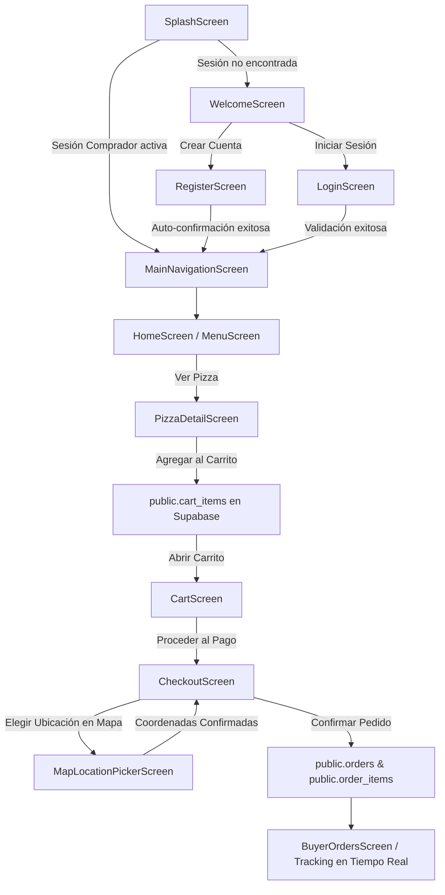
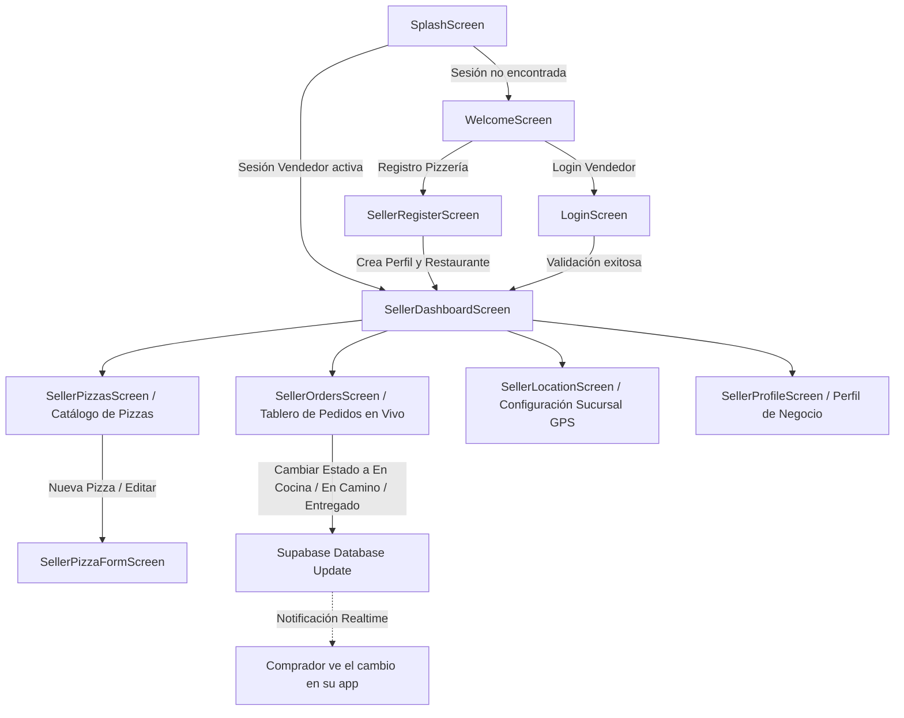

# Documentación Técnica del Proyecto PizzApp

Esta documentación detalla la arquitectura técnica, el modelo relacional en **Supabase PostgreSQL**, las políticas de seguridad **Row Level Security (RLS)**, el flujo de autenticación, la gestión del estado reactiva con **Riverpod 3** y **ValueNotifier**, los Datasources y Mappers, el sistema de WebSockets con **Supabase Realtime**, y los flujos de usuario.

---

## 📲 Descarga de la Aplicación (APK)

* Enlace de descarga directo: **[https://zurl.mmabitec.uk/tnqNOO](https://zurl.mmabitec.uk/tnqNOO)**

---

## 1. Estructura del Proyecto

El código fuente en `lib/` está organizado bajo una arquitectura limpia y desacoplada por capas:

```text
lib/
├── core/
│   ├── bootstrap/
│   │   └── app_bootstrap.dart          # Inicialización y validación del cliente Supabase
│   ├── config/
│   │   └── app_config.dart             # Lectura de variables con String.fromEnvironment
│   ├── navigation/
│   │   └── custom_navigator.dart       # Transiciones y navegación fluida con Fade
│   └── validators/
│       └── form_validators.dart        # Validadores de correo, contraseña, URLs y campos obligatorios
├── data/
│   ├── datasources/
│   │   ├── auth_datasource.dart        # Supabase Auth, manejo de sesión y perfiles
│   │   ├── cart_datasource.dart        # Carrito persistente en base de datos (public.cart_items)
│   │   ├── order_datasource.dart       # Creación, lectura y actualización de pedidos
│   │   ├── pizza_datasource.dart       # Catálogo y CRUD de pizzas
│   │   └── restaurant_datasource.dart  # Gestión de sucursales y ubicaciones
│   └── mappers/
│       ├── order_mapper.dart           # Mapeo y sanitización UUID OrderModel / OrderItemModel <-> Supabase Map
│       ├── pizza_mapper.dart           # Mapeo PizzaModel <-> Supabase Map
│       ├── restaurant_mapper.dart      # Mapeo RestaurantModel <-> Supabase Map
│       └── user_mapper.dart            # Mapeo UserProfile <-> Supabase Map
├── models/
│   ├── cart_item_model.dart            # Modelo de item del carrito con serialización a BD
│   ├── order_model.dart                # Modelos OrderModel y OrderItemModel
│   ├── pizza_data.dart                 # Catálogo fallback / inicial
│   ├── pizza_model.dart                # Modelo de entidad Pizza
│   ├── restaurant_model.dart           # Modelo de entidad Restaurante / Pizzería
│   └── user_profile.dart               # Modelo de entidad Usuario con roles (comprador / vendedor)
├── presentation/
│   ├── providers/
│   │   ├── auth_provider.dart          # AuthNotifier con AsyncNotifier de Riverpod 3
│   │   ├── cart_provider.dart          # CartNotifier con sincronización Realtime en BD
│   │   ├── location_provider.dart      # LocationNotifier con GPS y Geolocator
│   │   ├── order_provider.dart         # BuyerOrdersNotifier y SellerOrdersNotifier con Realtime
│   │   ├── pizza_provider.dart         # pizzasProvider y SellerPizzasNotifier con Realtime
│   │   └── restaurant_provider.dart    # restaurantsProvider y SellerRestaurantNotifier
│   ├── screens/
│   │   ├── buyer_orders_screen.dart    # Seguimiento de pedidos con Stepper de 4 etapas
│   │   ├── buyer_profile_screen.dart   # Perfil del comprador y cierre de sesión
│   │   ├── cart_screen.dart            # Carrito de compras con totales y checkout
│   │   ├── checkout_screen.dart        # Finalización de compra, método de pago y selector de mapa
│   │   ├── home_screen.dart            # Inicio con banner, buscador y pizzas populares
│   │   ├── login_screen.dart           # Inicio de sesión con validación estricta de credenciales
│   │   ├── main_navigation_screen.dart # Contenedor de 5 pestañas con FAB interactivo
│   │   ├── map_location_picker_screen.dart # Selector interactivo de coordenadas en OpenStreetMap
│   │   ├── map_screen.dart             # Mapa interactivo de pizzerías con GPS
│   │   ├── menu_screen.dart            # Catálogo filtrable por categorías y buscador
│   │   ├── pizza_detail_screen.dart    # Detalle con info de la pizzería y selector de tamaño
│   │   ├── register_screen.dart        # Registro de usuarios compradores
│   │   ├── screens.dart                # Archivo de barril para pantallas
│   │   ├── seller/
│   │   │   ├── seller_dashboard_screen.dart  # Navegación del panel de vendedor
│   │   │   ├── seller_location_screen.dart   # Registro/Edición de sucursal con GPS
│   │   │   ├── seller_orders_screen.dart     # Gestión y cambio de estado de pedidos en tiempo real
│   │   │   ├── seller_pizza_form_screen.dart # Formulario de alta/edición de pizzas
│   │   │   ├── seller_pizzas_screen.dart     # Catálogo de pizzas del vendedor
│   │   │   └── seller_profile_screen.dart    # Perfil y estado del negocio
│   │   ├── seller_register_screen.dart # Registro dedicado para vendedores/pizzerías
│   │   ├── splash_screen.dart          # Splash reactivo con verificación de sesión en cascada
│   │   └── welcome_screen.dart         # Bienvenida con acceso a Comprador/Vendedor
│   └── widgets/
│       ├── app_top_bar.dart            # AppBar personalizada reutilizable
│       ├── cart_button_badge.dart      # Botón de carrito con contador badge dinámico
│       ├── cart_item_card.dart         # Tarjeta de item de carrito con selector de cantidad
│       ├── category_filter_chips.dart  # Chips interactivos de categorías
│       ├── custom_bottom_nav_bar.dart  # Barra inferior de navegación estilizada
│       ├── custom_button.dart          # Botón estilizado con soporte isLoading y variantes
│       ├── custom_text_field.dart      # Input redondeado con validación visual y errorText
│       ├── dashed_oven_loader.dart     # Loader animado de horno pizzero
│       ├── order_summary_card.dart     # Tarjeta de resumen de compra y desglose
│       ├── pizza_list_item.dart        # Fila/Tile de pizza en el menú
│       ├── pizza_logo.dart             # Logotipo vectorial estilizado
│       ├── pizza_popular_card.dart     # Tarjeta destacada de pizza popular
│       ├── promo_banner.dart           # Banner promocional interactivo
│       ├── quantity_selector.dart      # Selector (+ / -) de cantidad
│       └── widgets.dart                # Archivo de barril para widgets
├── theme/
│   └── app_colors.dart                 # Paleta de colores centralizada
├── env.dev.json                        # Variables de entorno para desarrollo
├── supabase_schema.sql                 # Script SQL de creación de tablas, RLS y Realtime
└── main.dart                           # Punto de entrada con ProviderScope y Bootstrap
```

---

## 2. Configuración de Variables de Entorno

El proyecto lee la configuración directamente en tiempo de compilación o ejecución mediante `String.fromEnvironment`:

### Estructura de `env.dev.json`:
```json
{
  "SUPABASE_URL": "https://lswrefspqggtfdtbgbad.supabase.co",
  "SUPABASE_ANON_KEY": "sb_publishable_sLndhEuXcF4chwpgDugOmg_W3RitByu"
}
```

### Ejecución de la aplicación:
```bash
flutter run --dart-define-from-file=./env.dev.json
```

---

## 3. Modelo de Datos y Seguridad en Supabase (`supabase_schema.sql`)

### Tablas Principales:

1. **`public.profiles`**:
   - `id UUID PRIMARY KEY REFERENCES auth.users(id) ON DELETE CASCADE`
   - `email TEXT NOT NULL`, `full_name TEXT NOT NULL`
   - `role TEXT NOT NULL CHECK (role IN ('comprador', 'vendedor'))`
   - `created_at TIMESTAMPTZ NOT NULL DEFAULT NOW()`

2. **`public.restaurants`**:
   - `id UUID PRIMARY KEY DEFAULT uuid_generate_v4()`
   - `seller_id UUID NOT NULL REFERENCES public.profiles(id) ON DELETE CASCADE`
   - `name TEXT NOT NULL`, `description TEXT`, `address TEXT NOT NULL`
   - `latitude DOUBLE PRECISION NOT NULL`, `longitude DOUBLE PRECISION NOT NULL`
   - `phone TEXT`, `image_url TEXT`
   - `created_at TIMESTAMPTZ NOT NULL DEFAULT NOW()`

3. **`public.pizzas`**:
   - `id UUID PRIMARY KEY DEFAULT uuid_generate_v4()`
   - `restaurant_id UUID NOT NULL REFERENCES public.restaurants(id) ON DELETE CASCADE`
   - `name TEXT NOT NULL`, `description TEXT NOT NULL`, `price NUMERIC(10, 2) NOT NULL`
   - `image_url TEXT NOT NULL`, `sizes JSONB NOT NULL DEFAULT '["Personal", "Mediana", "Familiar"]'`
   - `category TEXT NOT NULL DEFAULT 'Clasicas'`, `rating NUMERIC(3, 1) DEFAULT 5.0`
   - `reviews_count INT DEFAULT 0`, `is_available BOOLEAN DEFAULT true`

4. **`public.cart_items`** (Carrito persistente en base de datos):
   - `id UUID PRIMARY KEY DEFAULT uuid_generate_v4()`
   - `user_id UUID NOT NULL REFERENCES public.profiles(id) ON DELETE CASCADE`
   - `pizza_id UUID NOT NULL REFERENCES public.pizzas(id) ON DELETE CASCADE`
   - `quantity INT NOT NULL DEFAULT 1 CHECK (quantity > 0)`
   - `size TEXT NOT NULL DEFAULT 'Mediana'`
   - `UNIQUE(user_id, pizza_id, size)`

5. **`public.orders`**:
   - `id UUID PRIMARY KEY DEFAULT uuid_generate_v4()`
   - `buyer_id UUID NOT NULL REFERENCES public.profiles(id) ON DELETE CASCADE`
   - `restaurant_id UUID NOT NULL REFERENCES public.restaurants(id) ON DELETE RESTRICT`
   - `status TEXT NOT NULL DEFAULT 'pendiente' CHECK (status IN ('pendiente', 'en_preparacion', 'en_camino', 'entregado', 'cancelado'))`
   - `total_amount NUMERIC(10, 2) NOT NULL`, `delivery_address TEXT NOT NULL`
   - `payment_method TEXT NOT NULL DEFAULT 'Efectivo'`, `notes TEXT`

6. **`public.order_items`**:
   - `id UUID PRIMARY KEY DEFAULT uuid_generate_v4()`
   - `order_id UUID NOT NULL REFERENCES public.orders(id) ON DELETE CASCADE`
   - `pizza_id UUID REFERENCES public.pizzas(id) ON DELETE SET NULL`
   - `pizza_name TEXT NOT NULL`, `quantity INT NOT NULL CHECK (quantity > 0)`
   - `unit_price NUMERIC(10, 2) NOT NULL`, `size TEXT NOT NULL DEFAULT 'Mediana'`

---

### Políticas Row Level Security (RLS):

* **`profiles`**: Lectura permitida a usuarios autenticados (`TO authenticated`); inserción y actualización protegidas con `auth.uid() = id`.
* **`restaurants` y `pizzas`**: Lectura pública (`TO authenticated, anon`); creación, edición y eliminación restringidas exclusivamente al vendedor propietario (`seller_id = auth.uid()`).
* **`cart_items`**: Aislamiento por usuario con `USING (auth.uid() = user_id)` y `WITH CHECK (auth.uid() = user_id)`.
* **`orders` y `order_items`**: Visibilidad exclusiva para el comprador (`buyer_id = auth.uid()`) o el vendedor del restaurante (`restaurants.seller_id = auth.uid()`).

---

### Triggers y Seguridad de Funciones:

1. **`on_auth_user_auto_confirm`**: Auto-confirma inmediatamente el campo `email_confirmed_at` de nuevos usuarios en `auth.users`, eliminando la necesidad de verificación manual por correo.
2. **`on_auth_user_created`**: Función `handle_new_user()` con `SECURITY DEFINER` y `SET search_path = public` que sincroniza automáticamente nuevos registros de `auth.users` hacia `public.profiles`.

---

## 4. WebSockets y Sincronización en Tiempo Real (Supabase Realtime)

La publicación `supabase_realtime` en PostgreSQL incluye las tablas:
* `orders`, `order_items`, `pizzas`, `restaurants`, `cart_items`.

### Canales en la aplicación:
* **Comprador**: Canal `public:orders:buyer:<id>` para escuchar cambios de estado de cocina y reparto en tiempo real.
* **Vendedor**: Canal `public:orders:restaurant:<id>` para recibir órdenes entrantes inmediatamente sin recargar.
* **Catálogo**: Canal `public:pizzas:all` para reflejar actualizaciones de precios y disponibilidad al instante.
* **Carrito**: Canal `public:cart_items:<id>` para mantener el carrito sincronizado entre pestañas y dispositivos.

---

## 5. Gestión del Estado con Riverpod 3

* **`authProvider`**: `AsyncNotifier` que escucha `onAuthStateChange` y gestiona el ciclo de vida de la sesión.
* **`cartProvider`**: `Notifier` que maneja el carrito con sincronización directa hacia `public.cart_items` y métodos `addItem`, `updateQuantity`, `removeItem`, `clearCart`.
* **`buyerOrdersProvider`**: `AsyncNotifier` que gestiona las órdenes del cliente con suscripción Realtime.
* **`sellerOrdersProvider`**: `AsyncNotifier` que gestiona las órdenes de la pizzería con actualización de estado (`pendiente` ➔ `en_preparacion` ➔ `en_camino` ➔ `entregado`).
* **`pizzasProvider`**: `FutureProvider` con suscripción a cambios en catálogo de pizzas.
* **`sellerPizzasProvider`**: `AsyncNotifier` para administración y CRUD de pizzas del vendedor.
* **`userLocationProvider`**: `AsyncNotifier` que interactúa con el sensor GPS y la API de geolocalización.

---

## 6. Flujos de Usuario y Transición de Pantallas

### A. Diagrama de Flujo del Comprador:



#### Fases del Comprador:
1. **Acceso y Detección**: `SplashScreen` resuelve la sesión en cascada. Si existe un token válido de comprador, entra inmediatamente a `MainNavigationScreen`. Si no, ofrece registro e inicio de sesión.
2. **Exploración**: `HomeScreen` y `MenuScreen` con selector de categorías, buscador reactivo y botón `CartButtonBadge` en la barra superior.
3. **Detalle y Personalización**: `PizzaDetailScreen` permite seleccionar tamaños (*Personal*, *Mediana*, *Familiar*), consultar información del restaurante y guardar items en `public.cart_items`.
4. **Finalización de Compra**: `CheckoutScreen` permite seleccionar método de pago (*Efectivo*, *Tarjeta*, *SPEI*) e interactuar con `MapLocationPickerScreen` para tocar en OpenStreetMap o usar GPS.
5. **Seguimiento en Vivo**: `BuyerOrdersScreen` muestra el Stepper de 4 pasos (*Pendiente*, *En Cocina*, *En Camino*, *Entregado*), actualizándose en tiempo real mediante WebSockets.

---

### B. Diagrama de Flujo del Vendedor / Pizzería:



#### Fases del Vendedor:
1. **Alta del Negocio**: `SellerRegisterScreen` crea simultáneamente el usuario en `auth.users`, el perfil en `public.profiles` y el restaurante en `public.restaurants`.
2. **Tablero de Pedidos**: `SellerOrdersScreen` recibe pedidos en vivo por WebSockets, con filtros por estado y selector para avanzar el flujo de preparación y reparto.
3. **Gestión de Menú (CRUD)**: `SellerPizzasScreen` y `SellerPizzaFormScreen` permiten crear, modificar precios, cambiar disponibilidad o eliminar pizzas del catálogo.
4. **Configuración de Sucursal**: `SellerLocationScreen` gestiona el nombre del local, dirección física, teléfono y coordenadas GPS (con botón para capturar la posición actual del dispositivo).

