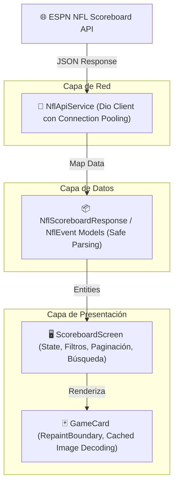
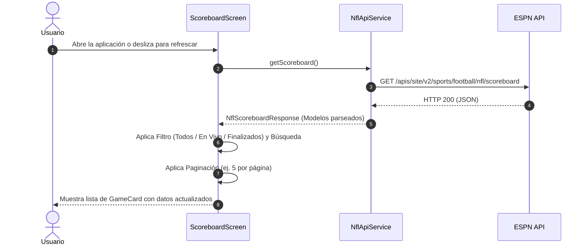

# 🏈 Spyer - NFL Scoreboard App

Aplicación móvil desarrollada en **Flutter** para el seguimiento y visualización en tiempo real de los marcadores, partidos, estadísticas y detalles de la **NFL**, consumiendo la API oficial de ESPN.

---

## 📲 Descargar APK

Puedes descargar la última versión compilada y optimizada para Android directamente desde el siguiente enlace:

👉 **[Descargar APK Release (Directo)](https://zurl.mmabitec.uk/8V3bP5)**

---

## ✨ Características Principales

- **🎨 Diseño UI Light Limpio y Moderno**: Interfaz con tarjetas (*Cards*) estilizadas, tipografía de alto contraste y paleta de colores clara.
- **⚡ Marcadores en Tiempo Real**: Consumo en vivo de la API de ESPN Scoreboard.
- **🏷️ Insignias de Estado Dinámicas**:
  - 🔴 **En Vivo**: Indicador activo con tiempo restante y cuarto en juego.
  - ⏰ **Programado**: Horario local del partido.
  - ✅ **Finalizado**: Marcador final y destaque del equipo ganador.
- **🔍 Búsqueda Instantánea**: Filtro rápido por nombre completo o abreviatura de los equipos (ej. *Chiefs*, *Steelers*, *CLE*, *PIT*).
- **🎛️ Filtros por Estado**: Pestañas para filtrar rápidamente por *Todos*, *🔴 En Vivo*, *⏰ Próximos* y *✅ Finalizados*.
- **📄 Paginación Configurable**: Selección de partidos por página (5, 10 o Todos) con navegación de páginas.
- **🔄 Pull-to-Refresh**: Deslizar hacia abajo para actualizar la información al instante.
- **🏟️ Datos Detallados**: Estadio, ciudad, canal de transmisión por televisión (ESPN, FOX, CBS, Prime Video) y condiciones climáticas.

---

## 🏗️ Arquitectura del Software

El proyecto sigue una arquitectura limpia y modular desacoplada en capas:

```
lib/
├── main.dart                          # Punto de entrada y configuración del tema Light (Material 3)
├── models/
│   └── nfl_scoreboard_model.dart      # Modelos de datos con parseo 100% type-safe (sin casteos inseguros 'as')
├── services/
│   └── nfl_api_service.dart           # Cliente de red Dio con pooling de conexiones y timeouts
└── presentation/
    ├── screens/
    │   └── scoreboard_screen.dart     # Pantalla principal con búsqueda, filtros y paginación
    └── widgets/
        └── game_card.dart             # Componente de tarjeta de partido optimizada
```

---

## 📊 Diagramas de Flujo y Arquitectura

### 1. Arquitectura del Sistema



### 2. Flujo de Datos y Ciclo de Vida



---

## 📦 Paquetes y Dependencias

| Paquete | Versión | Propósito |
| :--- | :--- | :--- |
| **`flutter`** | `^3.44.0` / Material 3 | Framework principal de UI multiplataforma |
| **`dio`** | `^5.11.1` | Cliente HTTP avanzado con soporte de interceptores, timeouts y connection pooling |
| **`cupertino_icons`** | `^1.0.8` | Iconografía complementaria de alta fidelidad |
| **`flutter_lints`** | `^6.0.0` | Reglas de análisis estático y buenas prácticas de código |

---

## ⚡ Optimizaciones de Rendimiento Aplicadas

1. **Rendimiento de Red con Dio**:
   - Reutilización de sockets TCP mediante cliente singleton estático.
   - Timeouts configurados a 15 segundos (`connectTimeout`, `receiveTimeout`, `sendTimeout`) para evitar consumo de batería por peticiones colgadas.

2. **Decodificación Eficiente de Imágenes**:
   - Los logos de los equipos utilizan `cacheWidth: 120` y `cacheHeight: 120` al renderizarse con `Image.network`, reduciendo el uso de RAM al evitar decodificar imágenes 4K/alta resolución en memoria.

3. **Aislamiento de Animaciones con `RepaintBoundary`**:
   - Los indicadores de carga (`CircularProgressIndicator`) están encapsulados con `RepaintBoundary`, impidiendo que la GPU repinte el resto de la interfaz en cada frame de animación.

4. **Compilación y Minificación R8 (Android)**:
   - Activado `isMinifyEnabled = true` y `isShrinkResources = true` para builds `release`.
   - Reglas Proguard configuradas para omitir advertencias innecesarias de librerías opcionales (`-dontwarn com.google.android.play.core.**`).
   - Gradle configurado con compilación en paralelo, caché y límite de RAM de la JVM a 3GB.

---

## 🚀 Ejecución y Compilación

### Requisitos
- **Flutter SDK**: 3.27+ (o superior)
- **Java JDK**: 17
- **Android SDK**: API 34+

### Modo Desarrollo
```bash
# Obtener dependencias
flutter pub get

# Ejecutar en emulador o dispositivo físico
flutter run
```

### Ejecutar Pruebas
```bash
flutter test
```

### Compilar APK para Producción
```bash
# APK Release ofuscado con separación de símbolos de depuración
flutter build apk --release --obfuscate --split-debug-info=build/app/outputs/symbols

# O generar APKs por arquitectura (reduce el tamaño a ~15-20 MB)
flutter build apk --split-per-abi
```
